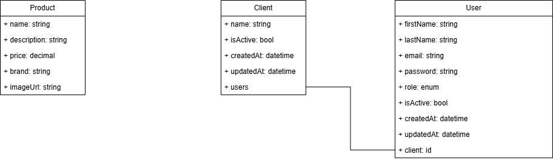

# BileMo API

REST catalog powered by Symfony 6.4 & API Platform.

## Architecture : diagrammes

| Vue | Fichier | Aperçu |
|-----|---------|--------|
| UML – Diagramme de classes | [`docs/diagrams/Diagramme classe.png`](docs/diagrams/Diagramme classe.png) |  |
| UML – Séquence « Create User » | [`docs/diagrams/Diagramme séquence.png`](docs/diagrams/Diagramme séquence.png) |  |
| Entity-Relationship (ERD) | _à venir dans l’issue “create database & ER diagram”_ | – |

