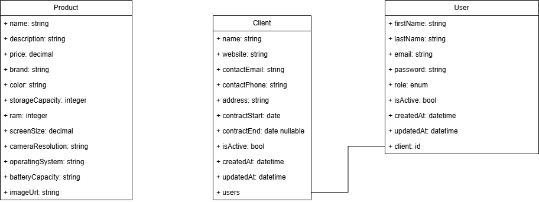
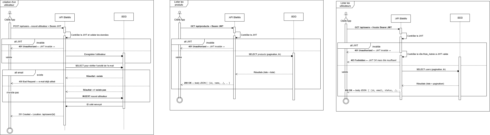
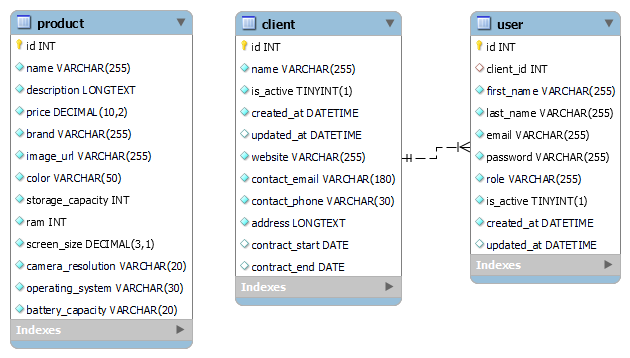

# BileMo API

REST catalog powered by Symfony 6.4 & API Platform.

## Architecture : diagrammes

### UML – Diagramme de classes
* Fichier : `docs/diagrams/DiagramClasse.png`  
* Aperçu :  
  

### UML – Séquence « Create User »
* Fichier : `docs/diagrams/DiagramSequence.png`  
* Aperçu :  
  

### Entity-Relationship (MLD)
* Fichier : `docs/diagrams/MLD.png`  
* Aperçu :  
  


## Authentification JWT — tester manuellement

### Étape 1 : récupérer un token

Exécute dans un terminal :

```bash
curl -X POST http://localhost:8000/api/login_check \
     -H "Content-Type: application/json" \
     -d '{"email":"api@example.com","password":"secret"}'
```

Si les identifiants sont corrects, la réponse ressemble à :

{ "token": "eyJ0eXAiOiJKV1QiLCJhbGciOi..." }

Le champ token contient le JWT signé.

### Étape 2 : appeler une route protégée

Réutilise le jeton :

```bash
curl http://localhost:8000/api/products \
     -H "Authorization: Bearer <colle_ici_le_token>"
```
Sans l’en-tête : 401 Unauthorized.

Avec l’en-tête : 200 OK et la réponse JSON.

Générer ou régénérer les clés RSA

```bash
# Développement
php bin/console lexik:jwt:generate-keypair

# Environnement de test
php bin/console lexik:jwt:generate-keypair --env=test
```

Variables indispensables (à placer dans .env.local ou .env.test.local) :

```bash
JWT_PASSPHRASE="votre-passphrase"
JWT_SECRET_KEY="%kernel.project_dir%/config/jwt/private.pem"
JWT_PUBLIC_KEY="%kernel.project_dir%/config/jwt/public.pem"
```

Lancer les tests fonctionnels

```bash
composer run test
```

Les tests vérifient que :

/api/products renvoie 401 sans jeton.

Le même endpoint renvoie 200 avec un jeton valide (fixtures chargées automatiquement).

Le workflow CI exécute ces tests à chaque pull-request.

[](https://github.com/Adrien1988/BileMo_API/actions/workflows/ci.yml)
[](https://app.codacy.com/gh/Adrien1988/BileMo_API/dashboard?utm_source=gh&utm_medium=referral&utm_content=&utm_campaign=Badge_grade)
[](https://app.codacy.com/gh/Adrien1988/BileMo_API/dashboard?utm_source=github&utm_medium=referral)
